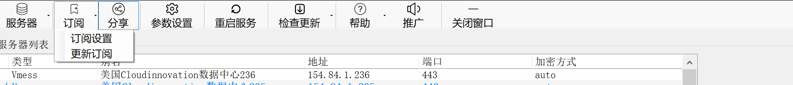
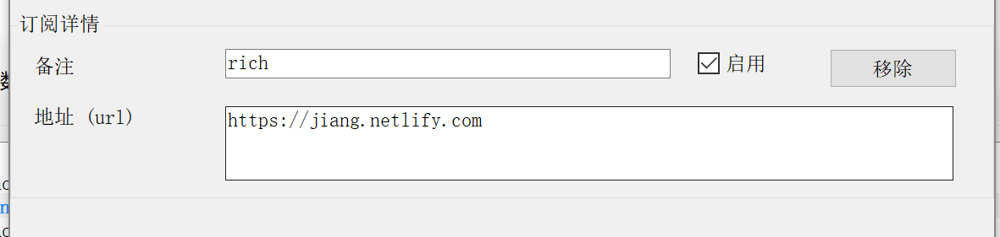
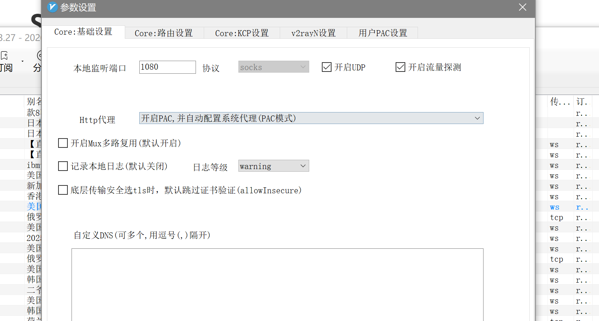
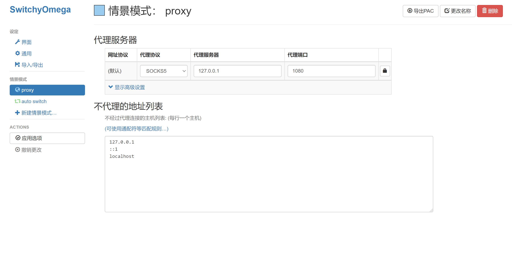
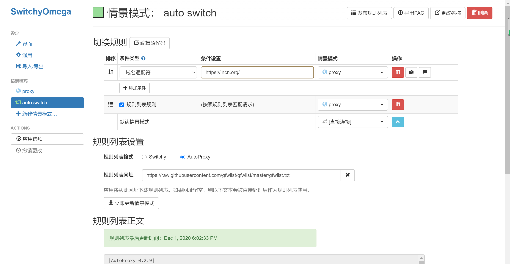
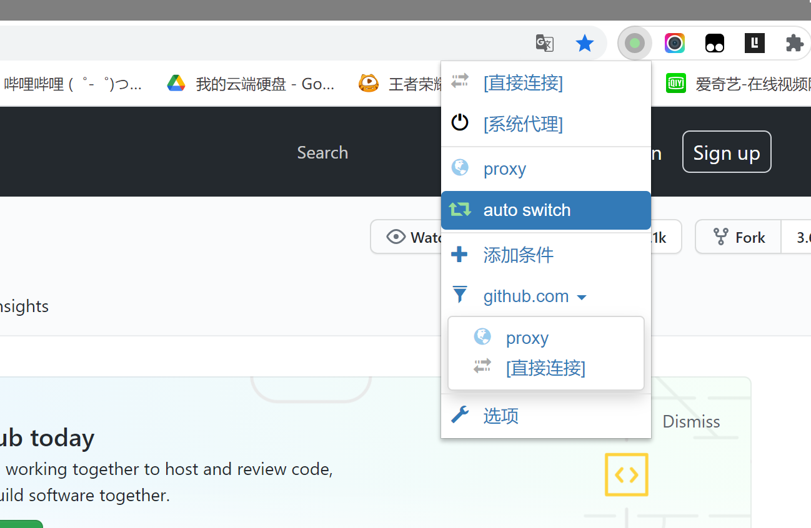

# Steps

1. 下载v2rayN软件,这软件只适用于Windows平台 [下载地址](https://github.com/2dust/v2rayN)

2. 打开软件参数设置，设置本地监听端口为`1080`，这里这样设置是因为socks协议默认端口是1080

3. 设置订阅链接，并更新订阅

   

   

4. 设置代理模式为`PAC`模式（绕过局域网和中国大陆）

   

5. 这时候电脑就可以科学上网了，但是某些网站还需要手动设置代理

6. 下载浏览器插件`SwitchyOmega`，直接在谷歌应用商店下载

7. 插件设置

   

8. 手动设置代理

